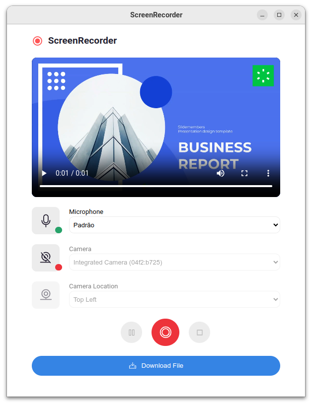

# ScreenRecorder

## A Simple Screen Recorder for Busy People

A Chrome extension to record your screen, your microphone, and export to MP4.

### Features

- [x] Record your screen
- [ ] Record your webcam
- [x] Record your microphone
- [ ] Record your system audio
- [X] Export to MP4

### How to Install

1. Download the [last package](https://github.com/wilfison/screen-recorder/releases/latest).
2. Go to the Extensions page by entering `chrome://extensions` in a new tab. Or, click the Extensions menu puzzle button and select Manage Extensions at the bottom of the menu.
3. Unpack the extension .zip file you downloaded.
4. Enable `Developer Mode` by clicking the toggle switch next to Developer mode.
5. Click the `Load unpacked` button and select the extension directory.

### How to Contribute

1. Fork this repository
2. Create a new branch (`git checkout -b feature`)
3. Commit your changes (`git commit -am 'Add a new feature'`)
4. Push to the branch (`git push origin feature`)
5. Create a new Pull Request
